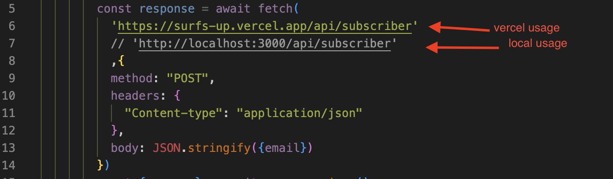

# Surf Camp Newsletter Subscription Landing Page

This project was created using Next.js, a full-stack framework, along with TypeScript, JavaScript, MongoDB, Mongoose, Nodemailer, React Hook Form, and Tailwind CSS.

## Features

- Main heading (h1): "Ride the Waves with Surf's Up Adventures"
- Subheading (h2): "Join our Surf Camp Trips and Catch the Perfect Wave under the Sun!"
- Subscription form with the following validations:
  - First input: Only accepts email format
  - Both fields are required
- Backend checks for existing email subscriptions and handles errors gracefully

## Testing the Landing Page

You can test the landing page by clicking on the following [link](https://surfs-up.vercel.app/)

## Getting Started

To run this project locally, follow these steps:

1. Clone the repository to your local machine.
2. Update in file postEmailRequest.ts url for fetching as showed on the image below:

3. update .env file with the necessary variables as described in env.example

4. Install the necessary dependencies using the following command:

```bash
npm install
```

5. Start the development server:

```bash
npm run dev
```

6. Open your browser and go to `http://localhost:3000` to view the landing page.

## Technologies Used

- Next.js
- TypeScript 
- JavaScript 
- MongoDB
- Mongoose
- Nodemailer
- React Hook Form
- Tailwind CSS
